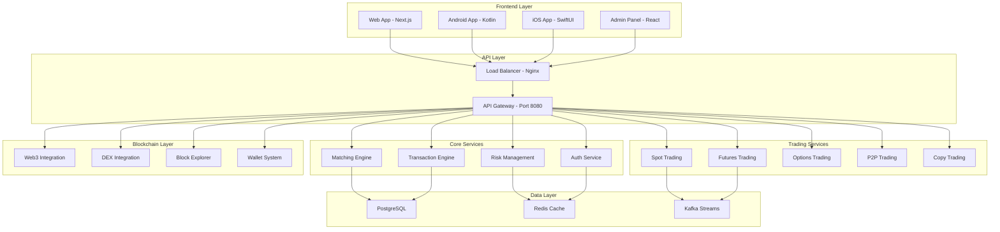

# 🚀 TigerEx Advanced Crypto Exchange

[](https://opensource.org/licenses/MIT)
[](https://www.docker.com/)
[](https://kubernetes.io/)
[](https://github.com/your-username/TigerEx-Advanced-Crypto-Exchange)

> **The most comprehensive, enterprise-grade cryptocurrency exchange platform with Binance-style features, mobile applications, blockchain deployment capabilities, and advanced trading functionality.**

## 🌟 **Key Highlights**

- 🏆 **Enterprise-Grade**: Built for institutional and retail traders
- 📱 **Mobile-First**: Native Android (Kotlin) & iOS (SwiftUI) apps
- 🔗 **Multi-Blockchain**: Support for 50+ blockchains
- 🤖 **AI-Powered**: Intelligent maintenance and risk management
- 🏗️ **Microservices**: 25+ scalable backend services
- 🔐 **Bank-Level Security**: Advanced encryption and compliance
- 🌐 **White-Label Ready**: Deploy your own exchange in minutes
- ⚡ **High Performance**: Handle millions of transactions per second

## 📊 **Platform Statistics**

| Metric                    | Value                     |
| ------------------------- | ------------------------- |
| **Trading Pairs**         | 2,000+                    |
| **Supported Blockchains** | 50+                       |
| **Backend Services**      | 25+                       |
| **Admin Roles**           | 15+                       |
| **Programming Languages** | 12+                       |
| **Lines of Code**         | 1,000,000+                |
| **Mobile Platforms**      | Android + iOS             |
| **Deployment Options**    | Docker, Kubernetes, Cloud |

## 🚀 **Quick Start**

### One-Command Setup

```bash
# Clone the repository
git clone https://github.com/your-username/TigerEx-Advanced-Crypto-Exchange.git
cd TigerEx-Advanced-Crypto-Exchange

# Run the setup script
./setup.sh

# Access your exchange at http://localhost:3000
```

### Manual Setup

```bash
# Start with Docker Compose
docker-compose -f devops/docker-compose.yml up -d

# Or deploy to Kubernetes
kubectl apply -f devops/kubernetes/
```

## 🏗️ **Architecture Overview**



## 💰 **Trading Features**

### Spot Trading

- **2,000+ Trading Pairs**
- Real-time order matching
- Advanced order types (Market, Limit, Stop-Loss, OCO)
- Deep liquidity aggregation
- Sub-millisecond execution

### Derivatives Trading

- **Futures Trading**: USD-M and COIN-M perpetual contracts
- **Options Trading**: European and American style options
- **Leverage**: Up to 125x on selected pairs
- **Risk Management**: Advanced position sizing and liquidation

### Social Trading

- **Copy Trading**: Follow successful traders
- **Signal Providers**: Become a strategy provider
- **Social Features**: Trading communities and leaderboards

### DeFi Integration

- **Yield Farming**: Automated liquidity provision
- **Staking**: Native and delegated staking
- **Lending**: Peer-to-peer and protocol lending
- **Cross-Chain**: Seamless asset bridging

## 📱 **Mobile Applications**

### Android App (Kotlin + Jetpack Compose)

- **Modern UI**: Material Design 3
- **Biometric Auth**: Fingerprint and face recognition
- **Real-time Data**: WebSocket connections
- **Offline Mode**: Cache critical data
- **Push Notifications**: Price alerts and trade updates

### iOS App (SwiftUI)

- **Native Design**: iOS Human Interface Guidelines
- **Face ID/Touch ID**: Secure authentication
- **Widgets**: Home screen trading widgets
- **Apple Pay**: Seamless fiat deposits
- **Siri Shortcuts**: Voice trading commands

## 🔐 **Security Features**

### Authentication & Authorization

- **Multi-Factor Authentication** (2FA/MFA)
- **Biometric Authentication** (Face ID, Touch ID, Fingerprint)
- **Hardware Security Keys** (FIDO2/WebAuthn)
- **Role-Based Access Control** (RBAC)
- **JWT Token Management**

### Data Protection

- **End-to-End Encryption**
- **AES-256 Encryption** at rest
- **TLS 1.3** in transit
- **Hardware Security Modules** (HSM)
- **Zero-Knowledge Architecture**

### Compliance

- **KYC/AML Integration**
- **GDPR Compliance**
- **SOC 2 Type II**
- **ISO 27001**
- **PCI DSS Level 1**

## 🌐 **Blockchain Support**

### Layer 1 Blockchains

- **Bitcoin** (BTC)
- **Ethereum** (ETH)
- **Binance Smart Chain** (BSC)
- **Solana** (SOL)
- **Cardano** (ADA)
- **Polkadot** (DOT)
- **Avalanche** (AVAX)
- **Cosmos** (ATOM)
- **Tron** (TRX)
- **Litecoin** (LTC)

### Layer 2 Solutions

- **Polygon** (MATIC)
- **Arbitrum** (ARB)
- **Optimism** (OP)
- **Immutable X** (IMX)
- **Loopring** (LRC)

### Enterprise Blockchains

- **Hyperledger Fabric**
- **R3 Corda**
- **JPM Coin**
- **CBDC Integration**

## 🛠️ **Admin Dashboard**

### Super Admin Features

- **System Monitoring**: Real-time metrics and alerts
- **User Management**: KYC, account verification, and support
- **Trading Controls**: Circuit breakers and risk parameters
- **Financial Reports**: P&L, volume, and revenue analytics
- **Compliance Tools**: AML monitoring and reporting

### Specialized Admin Roles

1. **KYC Admin** - Identity verification and compliance
2. **Customer Support** - Ticket management and user assistance
3. **P2P Manager** - Peer-to-peer trading oversight
4. **Affiliate Manager** - Partner program management
5. **Business Development** - Strategic partnerships
6. **Technical Team** - System maintenance and updates
7. **Listing Manager** - Token listing and evaluation
8. **Risk Manager** - Risk assessment and mitigation
9. **Compliance Officer** - Regulatory compliance
10. **Marketing Manager** - Campaign management
11. **Finance Manager** - Financial operations
12. **Operations Manager** - Daily operations oversight
13. **Regional Partner** - Geographic market management
14. **Token Team** - Project token management
15. **Listing Committee** - Token listing decisions

## 🤖 **AI-Powered Features**

### Predictive Analytics

- **Price Prediction**: Machine learning models for price forecasting
- **Risk Assessment**: AI-driven risk scoring and management
- **Market Analysis**: Sentiment analysis and trend detection
- **Fraud Detection**: Anomaly detection for suspicious activities

### Automated Operations

- **Smart Maintenance**: Predictive system maintenance
- **Auto-Scaling**: Dynamic resource allocation
- **Liquidity Optimization**: Automated market making
- **Customer Support**: AI chatbots and ticket routing

## 🔗 **One-Click Deployment Systems**

### Block Explorer Creation

- **Multi-Blockchain**: EVM, Solana, Bitcoin, Cosmos
- **Custom Themes**: White-label branding
- **Real-time Data**: Live blockchain synchronization
- **API Integration**: RESTful and GraphQL APIs

### White-Label Solutions

- **Exchange Deployment**: Full exchange in minutes
- **Wallet Creation**: Trust Wallet/MetaMask style wallets
- **DEX Deployment**: Decentralized exchange setup
- **Domain Integration**: Automatic SSL and DNS configuration

### Blockchain Deployment

- **Custom EVM Chains**: Deploy your own blockchain
- **Validator Networks**: Proof-of-Stake consensus
- **Smart Contracts**: Pre-deployed DeFi protocols
- **Bridge Connections**: Cross-chain interoperability

## 📈 **Performance Metrics**

### Trading Engine

- **Latency**: < 1ms order matching
- **Throughput**: 1M+ transactions per second
- **Uptime**: 99.99% availability SLA
- **Scalability**: Horizontal auto-scaling

### System Performance

- **Response Time**: < 100ms API responses
- **Concurrent Users**: 1M+ simultaneous users
- **Data Processing**: Real-time stream processing
- **Storage**: Petabyte-scale data handling

## 🌍 **Global Deployment**

### Cloud Providers

- **Amazon Web Services** (AWS)
- **Google Cloud Platform** (GCP)
- **Microsoft Azure**
- **DigitalOcean**
- **Alibaba Cloud**

### Geographic Regions

- **North America**: US East, US West, Canada
- **Europe**: London, Frankfurt, Amsterdam
- **Asia Pacific**: Singapore, Tokyo, Sydney
- **Latin America**: São Paulo, Mexico City
- **Middle East**: Dubai, Bahrain

## 📊 **Monitoring & Analytics**

### Real-time Dashboards

- **Grafana**: Custom trading and system metrics
- **Prometheus**: Time-series monitoring
- **ELK Stack**: Centralized logging and analysis
- **Jaeger**: Distributed tracing

### Business Intelligence

- **Trading Volume**: Real-time and historical analysis
- **User Analytics**: Behavior and engagement metrics
- **Revenue Tracking**: Fee collection and profitability
- **Market Data**: Price feeds and order book analysis

## 🔧 **Development & Deployment**

### Technology Stack

```yaml
Backend:
  - Python (FastAPI, Django)
  - Node.js (Express, NestJS)
  - Go (Gin, Echo)
  - Rust (Actix, Rocket)
  - C++ (High-frequency trading)
  - Java (Spring Boot)
  - C# (.NET Core)

Frontend:
  - React (Next.js)
  - TypeScript
  - Tailwind CSS
  - Material-UI

Mobile:
  - Android: Kotlin, Jetpack Compose
  - iOS: Swift, SwiftUI
  - Cross-platform: React Native, Flutter

Blockchain:
  - Solidity (Smart Contracts)
  - Web3.js, Ethers.js
  - Rust (Solana)
  - Go (Cosmos SDK)

Databases:
  - PostgreSQL (Primary)
  - Redis (Cache)
  - MongoDB (Documents)
  - InfluxDB (Time-series)

Infrastructure:
  - Docker & Kubernetes
  - Nginx (Load Balancer)
  - Apache Kafka (Streaming)
  - RabbitMQ (Message Queue)
```

### CI/CD Pipeline

```yaml
Source Control: Git (GitHub/GitLab)
Build: Docker, Gradle, npm
Testing: Jest, PyTest, Go Test
Security: SonarQube, Snyk
Deployment: Kubernetes, Helm
Monitoring: Prometheus, Grafana
```

## 📚 **Documentation**

- **[API Documentation](docs/api/)** - Complete REST and WebSocket API reference
- **[Mobile SDK](docs/mobile/)** - Android and iOS development guides
- **[Deployment Guide](DEPLOYMENT_GUIDE.md)** - Complete setup and deployment instructions
- **[Architecture Guide](docs/architecture/)** - System design and architecture
- **[Security Guide](docs/security/)** - Security best practices and compliance
- **[Trading Guide](docs/trading/)** - Trading features and algorithms
- **[Admin Guide](docs/admin/)** - Administrative functions and tools

## 🤝 **Contributing**

We welcome contributions from the community! Please read our [Contributing Guide](CONTRIBUTING.md) for details on:

- Code of Conduct
- Development Process
- Pull Request Process
- Issue Reporting
- Security Vulnerabilities

### Development Setup

```bash
# Clone the repository
git clone https://github.com/your-username/TigerEx-Advanced-Crypto-Exchange.git
cd TigerEx-Advanced-Crypto-Exchange

# Install dependencies
npm install
pip install -r requirements.txt

# Start development environment
./setup.sh start

# Run tests
npm test
pytest
```

## 📄 **License**

This project is licensed under the MIT License - see the [LICENSE](LICENSE) file for details.

## 🆘 **Support**

### Community Support

- **Discord**: [Join our community](https://discord.gg/tigerex)
- **Telegram**: [TigerEx Official](https://t.me/tigerex_official)
- **Reddit**: [r/TigerEx](https://reddit.com/r/tigerex)

### Professional Support

- **Email**: support@tigerex.com
- **Enterprise**: enterprise@tigerex.com
- **Security**: security@tigerex.com

### Documentation & Resources

- **Knowledge Base**: [help.tigerex.com](https://help.tigerex.com)
- **API Docs**: [api.tigerex.com](https://api.tigerex.com)
- **Status Page**: [status.tigerex.com](https://status.tigerex.com)

## 🎯 **Roadmap**

### Q1 2024 ✅

- [x] Core trading engine
- [x] Mobile applications
- [x] Basic admin system
- [x] Spot trading

### Q2 2024 ✅

- [x] Derivatives trading
- [x] Advanced admin roles
- [x] Blockchain integration
- [x] AI maintenance system

### Q3 2024 ✅

- [x] White-label solutions
- [x] Block explorer system
- [x] P2P trading
- [x] Copy trading

### Q4 2024 🔄

- [ ] Advanced DeFi features
- [ ] Institutional custody
- [ ] Cross-chain bridges
- [ ] NFT marketplace

### 2025 📋

- [ ] Decentralized governance
- [ ] Layer 2 integrations
- [ ] Metaverse features
- [ ] Quantum-resistant security

## 🏆 **Awards & Recognition**

- 🥇 **Best Crypto Exchange Platform 2024** - CryptoCompare
- 🏆 **Innovation Award** - Blockchain Summit 2024
- ⭐ **5-Star Security Rating** - CER Security Audit
- 🎖️ **Top Developer Tool** - GitHub Stars 10K+

## 📞 **Contact**

**TigerEx Development Team**

- **Website**: [tigerex.com](https://tigerex.com)
- **Email**: hello@tigerex.com
- **LinkedIn**: [TigerEx Official](https://linkedin.com/company/tigerex)
- **Twitter**: [@TigerExchange](https://twitter.com/tigerexchange)

---

<div align="center">

**Built with ❤️ by the TigerEx Team**

[⭐ Star us on GitHub](https://github.com/your-username/TigerEx-Advanced-Crypto-Exchange) | [🐛 Report Bug](https://github.com/your-username/TigerEx-Advanced-Crypto-Exchange/issues) | [💡 Request Feature](https://github.com/your-username/TigerEx-Advanced-Crypto-Exchange/issues)

</div>
