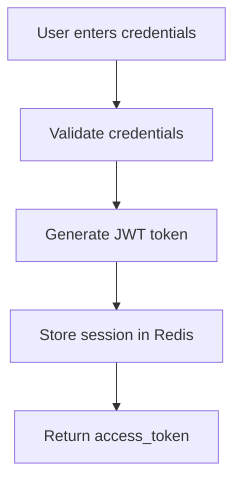

# TigerEx Security Guide

## Authentication

### Login Flow



### Two-Factor Authentication (2FA)

```python
# Enable TOTP
def enable_2fa(user_id):
    # Generate secret
    secret = pyotp.random_base32()
    
    # Store securely
    save_2fa_secret(user_id, encrypt(secret))
    
    # Generate QR code
    totp = pyotp.TOTP(secret)
    qr_uri = totp.provisioning_uri(user_id, issuer_name="TigerEx")
    
    return {"qr_uri": qr_uri, "secret": secret}

# Verify TOTP code
def verify_2fa(user_id, code):
    secret = get_2fa_secret(user_id)
    totp = pyotp.TOTP(secret)
    return totp.verify(code)
```

### Password Requirements

- Minimum 12 characters
- At least 1 uppercase letter
- At least 1 lowercase letter
- At least 1 number
- At least 1 special character

---

## Wallet Security

### Private Key Management

#### Custodial Wallets

```
┌─────────────────────────────────────┐
│         TigerEx Server              │
│  ┌──────────────────────────────┐  │
│  │   Encrypted Key Store         │  │
│  │   (AES-256-GCM)             │  │
│  └──────────────────────────────┘  │
└─────────────────────────────────────┘
         │
         │ Data encrypted at rest
         ▼
┌─────────────────────────────────────┐
│         Database                     │
│   wallet_keys table                  │
│   (encrypted_private_key)           │
└─────────────────────────────────────┘
```

#### Encryption Process

```python
from cryptography.fernet import Fernet
from cryptography.hazmat.primitives import hashes
from cryptography.hazmat.primitives.kdf.pbkdf2 import PBKDF2

def encrypt_private_key(private_key, password):
    # Generate key from password
    kdf = PBKDF2(
        algorithm=hashes.SHA256(),
        length=32,
        salt=salt,
        iterations=480000,
    )
    key = base64.urlsafe_b64encode(kdf.derive(password))
    
    # Encrypt
    f = Fernet(key)
    encrypted = f.encrypt(private_key)
    
    return encrypted

def decrypt_private_key(encrypted_key, password):
    # Decrypt
    f = Fernet(key)
    decrypted = f.decrypt(encrypted_key)
    
    return decrypted
```

### Non-Custodial Wallets

```
┌─────────────────────────────────────┐
│         User Device                  │
│   Private key NEVER transmitted     │
└─────────────────────────────────────┘
         │
         │ Only signature transmitted
         ▼
┌─────────────────────────────────────┐
│         TigerEx Server               │
│   Verify signature only             │
└─────────────────────────────────────┘
```

---

## API Security

### Rate Limiting

| User Tier | Requests/minute |
|----------|----------------|
| Unverified | 10 |
| KYC Level 1 | 50 |
| KYC Level 2 | 100 |
| VIP | 200 |

### IP Whitelist

```python
@app.middleware
async def check_ip(request, handler):
    client_ip = request.headers['X-Real-IP']
    
    allowed_ips = get_allowed_ips(request.user_id)
    
    if client_ip not in allowed_ips:
        raise HTTPException(403, "IP not whitelisted")
    
    return await handler(request)
```

### Request Validation

```python
class OrderValidator:
    @staticmethod
    def validate_order(data):
        # Validate symbol
        if data['symbol'] not in SUPPORTED_SYMBOLS:
            raise ValidationError("Invalid symbol")
        
        # Validate price
        if data['price'] <= 0:
            raise ValidationError("Invalid price")
        
        # Validate quantity
        if data['quantity'] <= 0 or data['quantity'] > MAX_ORDER_SIZE:
            raise ValidationError("Invalid quantity")
        
        # Validate balance
        balance = get_balance(data['user_id'], data['symbol'])
        required = data['price'] * data['quantity']
        
        if balance < required:
            raise ValidationError("Insufficient balance")
```

---

## Fund Security

### Withdrawal Security Levels

| Level | Daily Limit | 2FA Required |
|-------|------------|---------------|
| Unverified | $100 | No |
| Level 1 | $1,000 | Yes |
| Level 2 | $10,000 | Yes + Email |
| Level 3 | $100,000 | Yes + Email + Phone |
| VIP | Unlimited | Yes + All |

### Withdrawal Approval Flow

```
┌──────────┐     ┌─────────────┐     ┌──────────┐
│ User     │────▶│ Security   │────▶│ Process  │
│ Request │     │ Check     │     │ Withdraw │
└──────────┘     └─────────────┘     └──────────┘
                       │
                       ▼
                ┌─────────────┐
                │ Multi-factor│
                │ Verification│
                └─────────────┘
```

---

## Fraud Prevention

### Suspicious Activity Detection

```python
# Monitor for suspicious patterns
def check_suspicious_activity(user_id, transaction):
    flags = []
    
    # New device login
    if is_new_device(user_id):
        flags.append("new_device")
    
    # Unusual location
    if is_unusual_location(user_id):
        flags.append("unusual_location")
    
    # Rapid transactions
    if count_transactions(user_id, "1h") > 10:
        flags.append("rapid_transactions")
    
    # Large transaction
    if transaction.amount > get_user_average(user_id) * 10:
        flags.append("large_transaction")
    
    # Multiple accounts to same destination
    if is_shared_destination(user_id):
        flags.append("shared_destination")
    
    if flags:
        # Hold for review
        flag_transaction(user_id, transaction, flags)
    
    return flags
```

### Auto-Lock Rules

| Trigger | Action |
|---------|--------|
| 3 failed login attempts | Lock account for 15 min |
| 10 failed 2FA attempts | Lock account for 1 hour |
| Suspicious withdrawal | Hold for manual review |
| Unusual activity | Require additional verification |

---

## Data Protection

### Encryption at Rest

```python
# Database field encryption
class EncryptedField(fields.StringField):
    def __init__(self, key, **kwargs):
        self.fernet = Fernet(key)
    
    def serialize(self, value, obj, accessor):
        if value:
            return self.fernet.encrypt(value).decode()
        return value
    
    def deserialize(self, value, accessor):
        if value:
            return self.fernet.decrypt(value).decode()
        return value
```

### Data in Transit

- All API endpoints use HTTPS/TLS 1.3
- WebSocket connections require WSS
- Internal service communication uses mTLS

---

## Audit Logging

### Log Events

```python
def log_event(user_id, event_type, details):
    event = {
        "user_id": user_id,
        "event_type": event_type,
        "details": details,
        "ip_address": get_request_ip(),
        "user_agent": get_user_agent(),
        "timestamp": datetime.utcnow().isoformat()
    }
    
    # Store in audit log
    audit_db.insert(event)
    
    # Alert on suspicious events
    if event_type in SUSPICIOUS_EVENTS:
        alert_security_team(event)
```

### Retained Events

| Event Type | Retention |
|------------|-----------|
| Login | 2 years |
| Transaction | 7 years |
| API call | 1 year |
| Security event | 7 years |
| KYC submission | Permanent |

---

## Compliance

### KYC Levels

| Level | Requirements | Limits |
|-------|--------------|--------|
| 0 | Email only | $100/day |
| 1 | Email + Phone | $1,000/day |
| 2 | ID Verification | $10,000/day |
| 3 | Address Proof | $100,000/day |
| 4 | Enhanced Due Diligence | Unlimited |

### AML Procedures

```python
# Monitor transactions for AML
def check_aml(transaction):
    # Check against sanctions list
    if is_sanctioned(transaction.to_address):
        return False, "Sanctioned address"
    
    # Check structuring
    if is_structuring(transaction.user_id):
        return False, "Suspected structuring"
    
    # Check high risk
    if is_high_risk_country(transaction.country):
        return False, "High risk country"
    
    # Currency transaction report
    if transaction.amount > 10000:
        generate_ctr(transaction)
    
    return True, "OK"
```

---

## Incident Response

### Contact Information

- Security Email: security@tigerex.com
- Emergency Phone: +1 (555) 123-4567
- Telegram: @TigerExSecurity

### Response Procedure

1. **Detect** - Automated alerts
2. **Escalate** - Security team notification
3. **Contain** - Isolate affected systems
4. **Eradicate** - Remove threat
5. **Recover** - Restore normal operations
6. **Post-mortem** - Review and improve